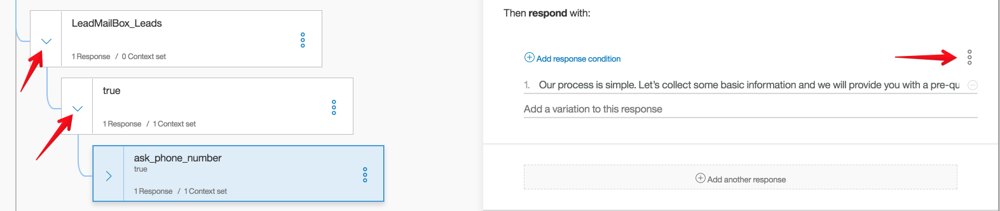

Configurations
--------------

Managing chatbot engine IBMWatson_.

.. _IBMWatson: https://www.ibmwatsonconversation.com/

Adding new chatbot to admin panel
^^^^^^^^^^^^^^^^^^^^^^^^^^^^^^^^^
First of all we need to make sure that we have ``env`` variable called ``WATSON_CONVERSATION_WORKSPACE_ID``
with specific value.

You can add/change it:
    * in ``.env`` file
    * with heroku command ``heroku config:set WATSON_CONVERSATION_WORKSPACE_ID=***************``
    * directly in `Heroku Dashboard`_ > Settings > Reveal Config Vars
.. _Heroku Dashboard: https://dashboard.heroku.com/`

To add new bot you need to navigate ``/ADMIN_URL/portal/chatbot/``

Select **Bot Engine** as ``IBM Watson Conversation``. Don't forget to fill ``Access ID`` field. You can find it on
IBMWatson_ > Deploy > Credentials > Workspace Details and copy ``Workspace ID``

Passing context from chatbot
^^^^^^^^^^^^^^^^^^^^^^^^^^^^
All response from new IBMWatson_ can be saved and processed on our side. All we have to do is add context variable
in bot's questions. To do that we need to open ``Dialog`` tab in IBMWatson_ dashboard and add following lines:

    $ "context": {
    $   "variable_name": "<? input_text ?>"
    $ },

Replace ``variable_name`` with desired keyword.

Working with backend
^^^^^^^^^^^^^^^^^^^^
Most of our bots are gathering specific data such as First Name, Phonenumber, Emails etc. In most cases all data
are saved in Leads for further processing.

Make sure that Widget setting is associated with new chatbot.

So far we have two internal services for handling data from the bots:
    * Entrata
    * Leadmailbox

Entrata
^^^^^^^
To enable Entrata requests simply add Chatbot with specific ``access_id`` and select checkbox called ``Is entrata``.
In this case all responses from user will be saved in a JSON ``request_data`` field in model ``EntrataRequest``.

Leadmailbox
^^^^^^^^^^^
Make sure to enable checkboxes ``Is leadmailbox`` and ``Is persist data``.
If you need add/modify/delete fields for this method see function called ``send_to_leadmailbox``
in ``webchat.chatbots.watsonbot.py``. For example, let's add a new field called ``Social Security Number``
into leadmailbox 'package'> Let's find ``def send_to_leadmailbox()`` function > then find a dictionary
with all fields called ``data``> and add a one line of code:
    $ "City": "self.context.get('city')",

Don't forget to add contex variable name ``city`` in IBMWatson_ dashboard.

Data for this service will be send right after ``end_conversation`` flag from the bot.

In case of fail - log will be saved.

Additional information about methods/functions and logic you can find in docstring in files like
``views.py``, ``models.py``
